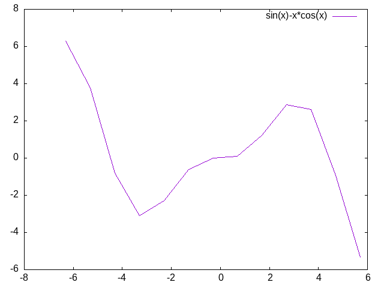

# Chart::EasyGnuplot
A simple modules to make simple plots, without having to think about
Gnuplot internals.

# Example
Let's plot the fuction "sin(x)-x*cos(x)"
```raku
use v6.d;
use Chart::EasyGnuplot;

my @x = 0.0 .. (2*π);
my @y = gather {
	for @x -> $x{
		take (sin($x)-$x*cos(x));
	}
}

line-plot("sin(x)-x*cos(x)", @x, @y, "Example.png");

```

